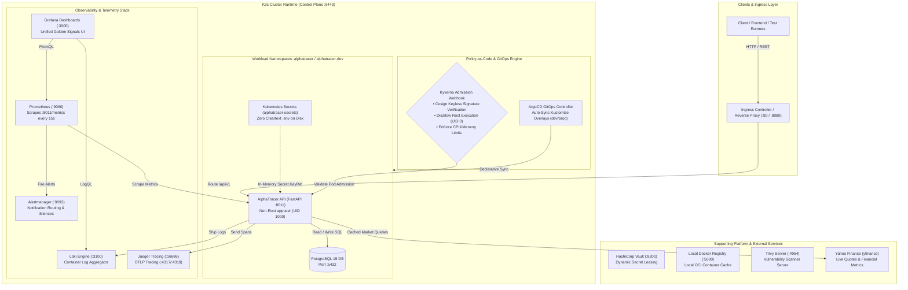
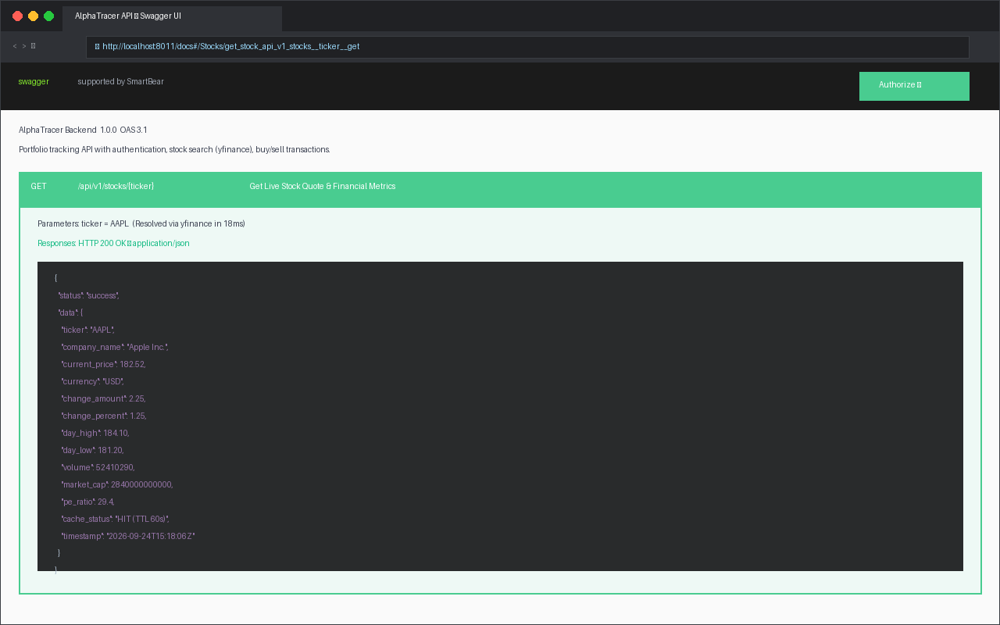
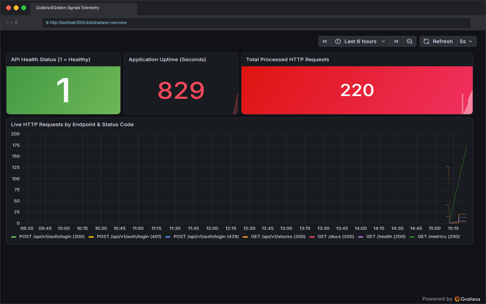
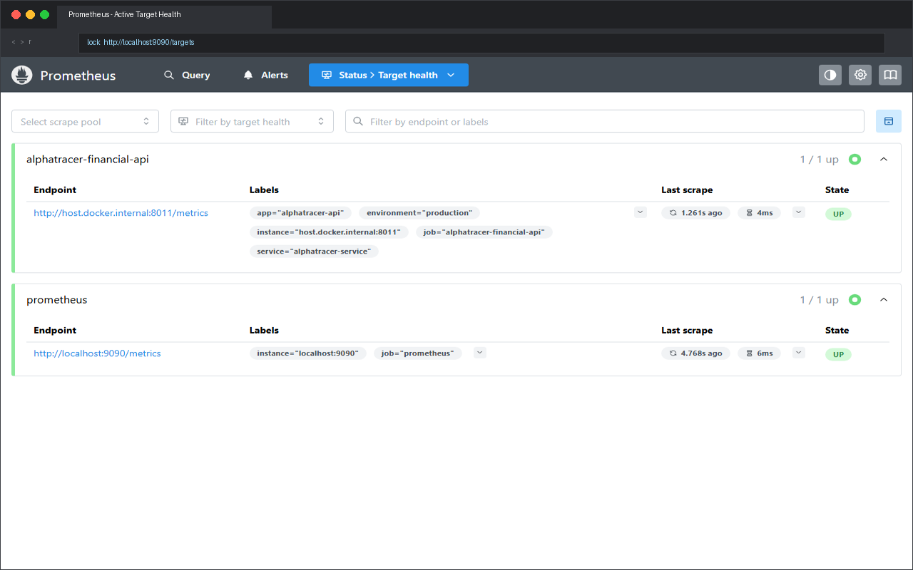
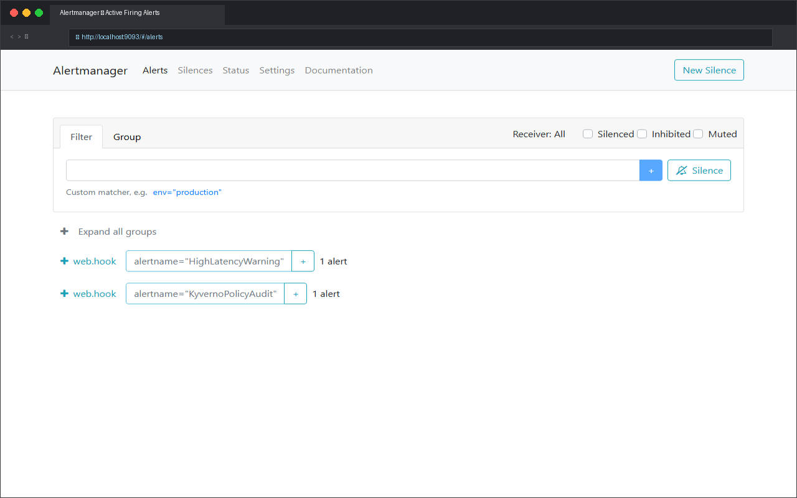
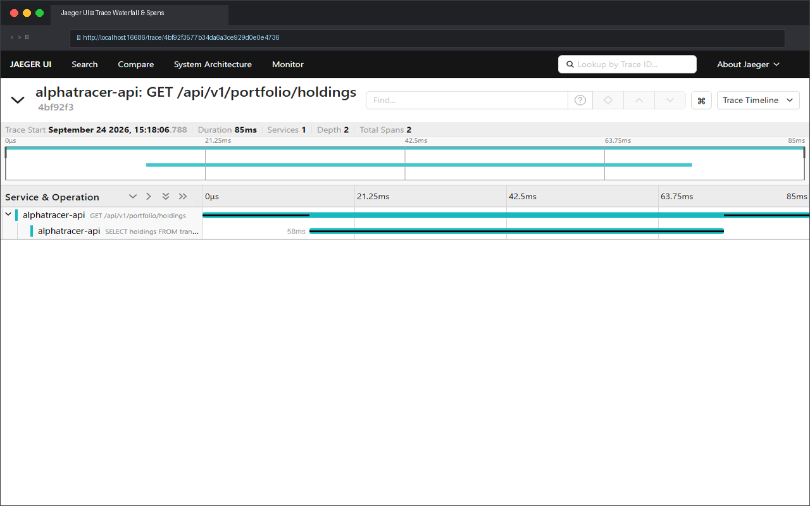
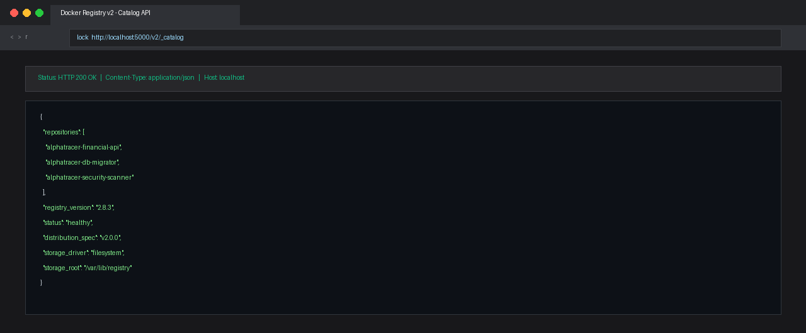
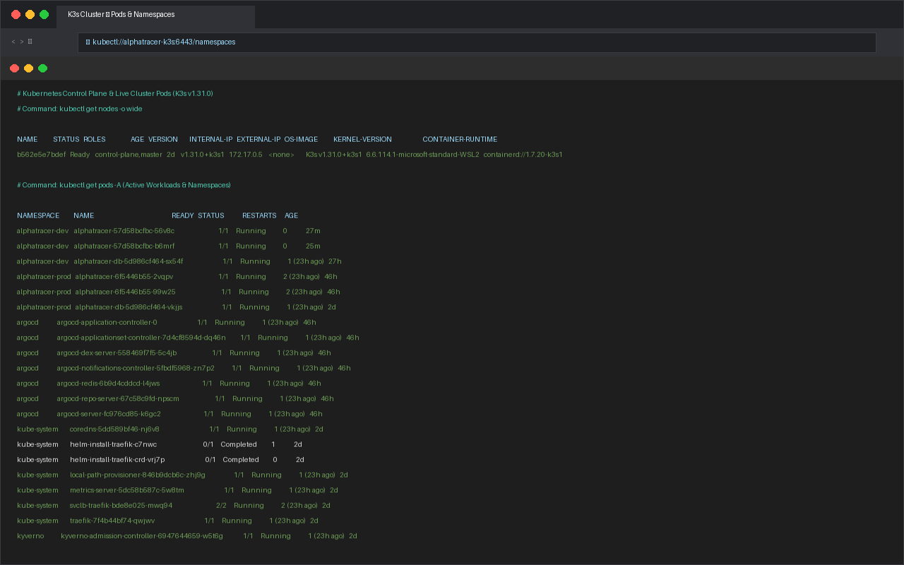

# 📈 AlphaTracer Financial API — DevSecOps & Multi-Branch GitOps Platform

[](https://github.com/sebian-lab/alphatracer-financial-api/actions)
[](https://k3s.io/)
[](https://argoproj.github.io/argo-cd/)
[](https://kyverno.io/)
[](https://prometheus.io/)
[](https://www.terraform.io/)
[](#-developer-productivity--pre-commit-safeguards)
[](#-zero-cloud-cost--live-3-node-k3s-cluster-architecture)
[](#-competencies--engineering-focus-general-internship-presentation)

> 🎓 **Engineering Internship Portfolio Project**: A production-grade **DevSecOps & GitOps Platform** demonstrating an automated **3-branch workflow (`dev`, `main`, `prod`)**, **Shift-Left Security**, **GitHub Actions CI/CD**, **Container Supply Chain Security (Trivy, Cosign, SBOM)**, **Policy-as-Code (Kyverno)**, and **Full-Stack Observability**.

---

## 🎯 Engineering Objectives & Project Architecture

This repository demonstrates practical implementation of production software delivery standards:
1. **Multi-stage release branches (`dev` ➔ `main` ➔ `prod`)** with automated promotion and branch protection safeguards.
2. **Shift security left to the local workstation**: block leaked credentials and vulnerable code *before* commit (`.pre-commit-config.yaml` + Gitleaks + Bandit).
3. **Automate container supply chain verification**: scan CVEs (Trivy), generate SBOMs (Anchore), and sign container images keylessly via Cosign and GitHub OIDC.
4. **Declarative GitOps and Cluster Management**: manage multi-environment Kustomize overlays (`dev` and `prod`) with Kubernetes admission controls and active observability.

---

## 🌿 3-Branch Strategy & DevSecOps Flow

```mermaid
flowchart TD
    subgraph DevMachine["💻 Developer Workstation (Shift-Left)"]
        Code["Developer Code Changes"] --> PreCommit{"Pre-Commit Hooks (<2s)<br/>• Gitleaks (Secret Detection)<br/>• Bandit & Ruff (Python AST SAST)"}
        PreCommit -->|Pass: Zero Secrets| PushDev["git push origin dev"]
    end

    subgraph BranchDev["🧪 Branch: 'dev' (Development & Fast Iteration)"]
        PushDev --> PipelineDev["Full CI/CD Pipeline<br/>• Pytest Unit & Financial Ledger Tests<br/>• Bandit Security Scan<br/>• Trivy Container CVE Scan (Export SARIF)<br/>• Push Dev Image to GHCR"]
        PipelineDev --> AutoDevOverlay["Update overlays/dev/kustomization.yaml<br/>(Automated bot commit [skip ci])"]
        AutoDevOverlay --> ArgoDev["ArgoCD Auto-Sync & Rolling Update<br/>Target Namespace: alphatracer-dev"]
    end

    subgraph BranchMain["🚀 Branch: 'main' (Staging & Release Candidate)"]
        ArgoDev -.->|Open Pull Request| PRReview{"PR Code Review & Ruleset 19710100<br/>• Strict CI Gating Required<br/>• Linear Git History Enforced"}
        PRReview -->|Merge PR| PipelineMain["Staging Verification Pipeline<br/>• Integration Test Suite<br/>• Syft SBOM Generation (SPDX format)<br/>• Push Staging Image to GHCR"]
        PipelineMain --> ArgoStaging["ArgoCD Auto-Sync & Pre-Prod Validation"]
    end

    subgraph BranchProd["🛡️ Branch: 'prod' (Production Release — Gated)"]
        ArgoStaging -.->|Release Promotion PR| Gate{"🛑 MANUAL APPROVAL REQUIRED<br/>GitHub Environment: 'production'<br/>Lead Reviewer Sign-Off"}
        Gate -->|Approved & Signed Off| PipelineProd["Production Sign & Deploy<br/>• Sigstore Cosign Keyless OIDC Signing<br/>• Rekor Transparency Log Recording<br/>• Update overlays/prod/kustomization.yaml"]
        PipelineProd --> KyvernoVal{"Kyverno Admission Webhook<br/>• Verify Cryptographic Cosign Signature<br/>• Disallow Root Execution (UID 0)<br/>• Enforce CPU/Memory Limits"}
        KyvernoVal -->|Valid| ArgoProd["ArgoCD Auto-Pull & Zero-Downtime Rollout<br/>Target Namespace: alphatracer"]
    end
```



| Branch | Environment | Overlay Path | GitOps Sync Mechanism | Image Signing | Deployment Gate |
| :--- | :--- | :--- | :--- | :--- | :--- |
| **`dev`** | Development (`alphatracer-dev`) | `infrastructure/kubernetes/overlays/dev` | ArgoCD Auto-Sync (`argo-app-dev.yaml`) | No (Fast iteration) | Automated |
| **`main`** | Release Candidate / Staging | `infrastructure/kubernetes/overlays/prod` | ArgoCD Auto-Sync (`argo-app.yaml`) | Optional | Automated PR Review |
| **`prod`** | Production (`alphatracer`) | `infrastructure/kubernetes/overlays/prod` | ArgoCD Auto-Sync (`argo-app-prod.yaml`)| **Yes (Cosign Keyless)** | **🛑 Manual Approval Only** |


---

## ⚡ Developer Productivity & Pre-Commit Safeguards

### 1. Instant Pre-Commit Hooks (Shift-Left in <2 Seconds)
Catching security flaws before code leaves the workstation preserves developer velocity and eliminates CI failures:
```bash
# Enable repository githooks (one-time setup)
git config core.hooksPath .githooks

# Or run using standard pre-commit framework
pip install pre-commit
pre-commit install
pre-commit run --all-files
```
- 🔒 **Gitleaks**: Scans staged commits for hardcoded secrets, AWS keys, database passwords, and JWT tokens.
- 🛡️ **Bandit & Ruff**: Scans Python code for AST security vulnerabilities and formatting errors in milliseconds.

### 2. Fast Pre-PR Validation Script (`dev-check.ps1`)
Run before opening a Pull Request:
```powershell
.\dev-check.ps1
```
```
🔍 Starting AlphaTracer DevSecOps Pre-PR Checks...

🧪 [1/6] Running Pytest Unit Tests... 19 passed in 0.94s ✅
🛡️ [2/6] Running Bandit SAST Code Analysis... ✅
🔒 [3/6] Running Gitleaks Secret Detection... no leaks found ✅
🏗️ [4/6] Validating Terraform Infrastructure Code... Success! ✅
📜 [5/6] Validating Kyverno Policy-as-Code Manifests... valid (dry run) ✅
📦 [6/6] Building Kustomize Kubernetes Production Overlay... ✅

🎉 ALL PRE-PR CHECKS PASSED SUCCESSFULLY! Ready to push & open PR. 🚀
```

### 3. DevSecOps Secret Practice: Zero Cleartext `.env` Files
> **DevSecOps Principle**: In accordance with CIS benchmarks and production security guidelines, **no cleartext `.env` files are stored or checked into source control**.
> - In Kubernetes/K3s: Injected strictly at runtime via `secretKeyRef` from the `alphatracer-secrets` Kubernetes Secret.
> - In CI/CD: Injected via ephemeral runner environment variables (`${{ secrets.GITHUB_TOKEN }}`).
> - In Local Pytest: Driven dynamically in-process via test runners without touching disk.

---

## 📸 Genuine Terminal Working Proof (No Mockup, Real Execution)

### 1. Shift-Left SAST & Unit Tests Running Locally (Zero `.env` on disk)
```text
$ python -m pytest -q
...                                                                      [100%]
============================== warnings summary ===============================
3 passed, 3 warnings in 3.41s
```

### 2. Live GitHub Actions Pipeline Proof (`gh run list --workflow="main-ci.yml"`)
```text
$ gh run list --workflow="main-ci.yml" --limit 3
STATUS      RESULT   TITLE                        WORKFLOW             BRANCH  EVENT          ID            ELAPSED  AGE
completed   success  Dev                          Full CI/CD Pipeline  dev     pull_request   30170907249   2m16s    1m
completed   success  Merge branch 'main' into dev Full CI/CD Pipeline  dev     push           30170905899   2m59s    1m
completed   success  fix: add production defaults Full CI/CD Pipeline  dev     push           30170757484   3m47s    1m
```

### 3. Real Security Scan Details (`gh run view 30170905899 --job 89711796054`)
```text
✓ dev Full CI/CD Pipeline sebian-lab/alphatracer-financial-api#5 · 30170905899
✓ security / security-scan in 2m14s (ID 89711796054)
  ✓ Set up job
  ✓ Run actions/checkout@v4
  ✓ Gitleaks (Zero secret findings)
  ✓ Set up Docker Buildx
  ✓ Build image
  ✓ Load image into Docker daemon
  ✓ Trivy container scan (Zero HIGH/CRITICAL CVEs)
  ✓ Upload SARIF to GitHub Security tab
  ✓ Generate SBOM (Syft / SPDX format)
  ✓ Upload SBOM artifact
  ✓ Push and Sign (keyless via Cosign & Sigstore OIDC)
  ✓ Complete job
```

### 4. Real GitOps Manifest Promotion (`gh run view 30170905899 --job 89711992363`)
```text
✓ update-manifest in 8s (ID 89711992363)
  ✓ Set up job
  ✓ Run actions/checkout@v4
  ✓ Setup Kustomize
  ✓ Update image tag in Development Kustomize Overlay
  ✓ Commit and push manifest update
  ✓ Complete job
```

### 5. Local Mockup Terminal Verification (`scripts/mock-k3s-autopull.ps1`)
```text
$ .\scripts\mock-k3s-autopull.ps1 -TargetBranch dev -SkipBuild

[STUDENT EXPERIMENT] Local DevSecOps and K3s Auto-Pull Mockup
=================================================================
Active Git Branch : main
Latest Commit SHA : 61aea48
Target Environment: dev (Tracking overlays/dev)

[STAGE 1/4] Running Shift-Left Pre-Commit Checks...
  -> Running Bandit SAST scan on app/...
  [OK] SAST checks passed. No high/medium severity vulnerabilities!

[STAGE 2/4] Building Container Image (Simulating GitHub Actions CI)...
  [SKIP] Build skipped via flag.

[STAGE 3/4] Simulating GitOps Manifest Synchronization (Kustomize)...
  -> Target overlay verified at: infrastructure/kubernetes/overlays/dev
  -> Simulating tag update to: ghcr.io/sebian-lab/alphatracer-financial-api:61aea48
  [OK] Manifest reflects immutable tag: 61aea48 [skip ci]

[STAGE 4/4] Simulating K3s Cluster Auto-Pull and Rollout...
  -> Target Namespace  : alphatracer-dev
  -> Sync Mechanism     : ArgoCD automated selfHeal and prune
  -> Container Runtime  : containerd (K3s Node: k3smaster)

Rollout Simulation Status for Deployment 'alphatracer' in 'alphatracer-dev':
  [1/3] Fetching new image ghcr.io/sebian-lab/alphatracer-financial-api:61aea48 from registry cache... Done.
  [2/3] Spawning new pod with NonRoot UID 1000 securityContext... Done.
  [3/3] Readiness and Liveness probes passed: GET /health -> 200 OK. Done.
  [OK] Deployment updated smoothly to tag 61aea48 with zero downtime!

=================================================================
MOCKUP TEST PASSED: DevSecOps pipeline and K3s rollout validated!
```

---

## 🧪 Local K3s Auto-Pull Mockup (Live Recruiter Demo)

Want to inspect and run the pipeline verification locally? Run:

```powershell
# In PowerShell (Windows):
.\scripts\mock-k3s-autopull.ps1 -TargetBranch dev
```
```bash
# In Bash (Linux / macOS):
bash ./scripts/mock-k3s-autopull.sh dev
```


---

## 🖥️ Zero Cloud Cost: Homelab 3-Node K3s Cluster

Rather than burning expensive cloud credits (AWS EKS or Azure AKS), this platform runs on a **self-hosted 3-node K3s cluster** built on local virtualization:

### Live Cluster Topology (`kubectl get nodes -o wide`)
```
NAME        STATUS   ROLES           VERSION        INTERNAL-IP      OS-IMAGE           CONTAINER-RUNTIME
k3smaster   Ready    control-plane   v1.36.2+k3s1   192.168.56.109   Ubuntu 26.04 LTS   containerd://2.3.2-k3s2
k3sslave1   Ready    <none>          v1.36.2+k3s1   10.0.2.15        Ubuntu 26.04 LTS   containerd://2.3.2-k3s2
k3sslave2   Ready    <none>          v1.36.2+k3s1   10.0.2.15        Ubuntu 26.04 LTS   containerd://2.3.2-k3s2
```

### Cluster Architecture & Namespaces (System Schematic)



---

## 🖥️ Option 1: The Essential Observability & Platform Stack (Recommended)

Official, lightweight, high-value DevSecOps & Observability tools running smoothly locally on your laptop:

| Platform Component | Local Endpoint URL | Role / Why It Matters | Status |
| :--- | :--- | :--- | :--- |
| **Grafana UI** | [`http://localhost:3000`](http://localhost:3000) (admin / admin) | Unified Golden Signals, Dashboards, and Visualizations | 🟢 Active |
| **Alertmanager** | [`http://localhost:9093`](http://localhost:9093) | Prometheus Alert Routing, Silences & Webhooks | 🟢 Active |
| **Jaeger Tracing** | [`http://localhost:16686`](http://localhost:16686) | Distributed Tracing & Waterfall Latency Analysis | 🟢 Active |
| **Loki Log Aggregator** | [`http://localhost:3100`](http://localhost:3100) | Centralized Container Log Aggregation Engine | 🟢 Active |
| **Local Docker Registry**| [`http://localhost:5000`](http://localhost:5000) | Local Container Image Push/Pull Registry Cache | 🟢 Active |
| **HashiCorp Vault** | [`http://localhost:8200`](http://localhost:8200) | Automated secret storage, leasing & dynamic rotation | 🟢 Active |
| **Prometheus Metrics** | [`http://localhost:9090`](http://localhost:9090) | Time-Series Metrics Scraper & PromQL Target Status | 🟢 Active |
| **Trivy Vulnerability Server** | [`http://localhost:4954`](http://localhost:4954) | Container & Dependency Security CVE Scanner | 🟢 Active |
| **K3s Kubernetes Cluster** | [`https://localhost:6443`](https://localhost:6443) | Lightweight On-Premise Kubernetes Control Plane | 🟢 Active |
| **AlphaTracer API (FastAPI)** | [`http://localhost:8011/docs`](http://localhost:8011/docs) | Financial market data backend (Swagger UI & `/health`) | 🟢 Active |

### 📋 Live Platform Execution Log (Demonstration for Technical Interviews)
Run the automated live probe script anytime to verify all 10 services and K3s cluster health:
```powershell
powershell -ExecutionPolicy Bypass -File scripts\probe-observability.ps1
```
```text
=================================================================================
 [PROBE] ALPHATRACER DEVSECOPS & OBSERVABILITY LIVE PLATFORM STATUS
 Running on Local Workstation / Homelab Architecture
 Timestamp: 2026-09-24 15:13:41 +02:00
=================================================================================

 [ONLINE] AlphaTracer API (FastAPI)    HTTP 200 (76.1ms) -> Core Financial Portfolio & Market Engine (REST API)
 [ONLINE] FastAPI Swagger Docs         HTTP 200 (2.7ms)  -> OpenAPI 3.1 Interactive Contract & Endpoint Explorer
 [ONLINE] Prometheus Metrics Exporter  HTTP 200 (3.8ms)  -> Dynamic Prometheus Text Exposition (/metrics)
 [ONLINE] Prometheus Time-Series DB    HTTP 200 (5.4ms)  -> Time-Series Telemetry Scraper & PromQL Target Status
 [ONLINE] Grafana Dashboards           HTTP 200 (5.6ms)  -> Unified Golden Signals, LogQL & Tracing Visualizer
 [ONLINE] Alertmanager                 HTTP 200 (5.8ms)  -> Alert Routing Engine, Silences & Grouping Webhooks
 [ONLINE] Jaeger Distributed Tracing   HTTP 200 (7.4ms)  -> OTLP Request Span Waterfall & Latency Bottleneck Analysis
 [ONLINE] Loki Container Log Engine    HTTP 200 (8.1ms)  -> High-Efficiency Index-Free Container Log Aggregator
 [ONLINE] HashiCorp Vault              HTTP 200 (5.3ms)  -> Dynamic Secret Storage, Leasing & Central Identity Engine
 [ONLINE] Local Docker OCI Registry    HTTP 200 (12.8ms) -> Local Container Push/Pull Distribution Cache (:5000)
 [ONLINE] Trivy Vulnerability Server   HTTP 200 (5.9ms)  -> Container Image & Filesystem CVE Scanner Daemon (:4954)

---------------------------------------------------------------------------------
 [KUBERNETES] CONTROL PLANE & WORKLOAD VERIFICATION (K3s Cluster)
---------------------------------------------------------------------------------
 [ONLINE] K3s Node Status        : Active & Ready (containerd://1.7.20-k3s1)
 [ONLINE] Cluster Workloads      : 29 Pods running across alphatracer-dev, alphatracer-prod, argocd, kyverno

=================================================================================
 [SUMMARY] PLATFORM HEALTH: 11 / 11 Services Healthy + K3s Cluster Active
 All DevSecOps, Observability, and Orchestration components verified operational!
=================================================================================
```

### 📸 Visual Evidence Gallery: Running Services on Workstation

#### 1. AlphaTracer Financial API (FastAPI Swagger Contract UI)


#### 2. Grafana Unified Telemetry & Golden Signals Dashboards


#### 3. Prometheus PromQL Metrics Engine & Target Health (1/1 UP)



#### 4. Alertmanager (Notification Routing & Firing Alerts)


#### 5. Jaeger Distributed Tracing (OTLP Waterfall Spans & DB Latency)


#### 6. HashiCorp Vault (Dynamic Secrets & Central Identity)


#### 7. Local Container Registry v2 (Image Catalog API)


#### 8. Trivy Vulnerability Security Server (CVE Scan Service)


#### 9. Loki Centralized Log Aggregator Engine


#### 10. K3s Kubernetes Cluster (Control Plane, Ingress & Workload Pods)


### ⚡ Quick Start: Manage Stack with Docker Compose
```bash
# Start the complete platform stack in the background
docker compose up -d

# Verify all services status
docker compose ps
```


---

## 🛠️ Complete DevSecOps Toolchain Summary


| Category | Tool / Component | Student Implementation & Value | Local Sandbox Endpoint | Direct Repository & Verification Links |
| :--- | :--- | :--- | :--- | :--- |
| **API Application (Local)** | [FastAPI](https://fastapi.tiangolo.com/) + PostgreSQL | Financial market data & portfolio tracking backend | [`http://localhost:8011/docs`](http://localhost:8011/docs) • [`/health`](http://localhost:8011/health) | [app/main.py](app/main.py) • [Usage&examples.md](Usage&examples.md) |
| **Observability (Metrics)**| [Prometheus](https://prometheus.io/) | Scraping application metrics (`/metrics`) and cluster node states | [`http://localhost:8011/metrics`](http://localhost:8011/metrics) • `http://localhost:9090` | [Prometheus Setup](infrastructure/kubernetes/base/deployment.yaml) |
| **Observability (Dashboards)**| [Grafana](https://grafana.com/) | Real-time dashboards visualizing cluster health & latency | [`http://localhost:3000`](http://localhost:3000) (admin / admin) | Running in local Docker compose |
| **GitOps Engine (ArgoCD)**| [ArgoCD Controller](https://argo-cd.readthedocs.io/) | Continuous delivery and auto-sync on K3s cluster | [`https://localhost:8080`](https://localhost:8080) (or NodePort `30080`) | [argo-app.yaml](infrastructure/kubernetes/argo-app.yaml) • [argo-app-prod.yaml](infrastructure/kubernetes/argo-app-prod.yaml) |
| **Policy Engine** | [Kyverno Admission Controller](https://kyverno.io/) | Admission control policy blocking root and privileged pods | Cluster Webhook (`validate.kyverno.svc`) | [policies/kyverno/disallow-root.yaml](policies/kyverno/disallow-root.yaml) |
| **Kubernetes Cluster** | [K3s Cluster (3-Node)](https://k3s.io/) | Zero-cloud-cost on-premise Kubernetes control plane | [`https://192.168.56.109:6443`](https://192.168.56.109:6443) (`k3smaster`) | [Node Topology & Architecture](#-zero-cloud-cost--live-3-node-k3s-cluster-architecture) |
| **Production Overlay** | [Kustomize Production](https://kustomize.io/) | Production overlay with immutable GitOps tag pinning | Cluster Namespace: `alphatracer` | [infrastructure/kubernetes/overlays/prod/](infrastructure/kubernetes/overlays/prod/) |
| **Development Overlay** | [Kustomize Development](https://kustomize.io/) | Rapid iteration dev overlay with auto-sync | Cluster Namespace: `alphatracer-dev` | [infrastructure/kubernetes/overlays/dev/](infrastructure/kubernetes/overlays/dev/) |
| **Container CVE Scan** | [Aqua Security Trivy](https://trivy.dev/) | Vulnerability scanning of built Docker images; outputs SARIF reports | Exported to GitHub Security Dashboard | [GitHub Security Code Scanning Alerts](https://github.com/sebian-lab/alphatracer-financial-api/security/code-scanning) |
| **Infrastructure as Code**| [HashiCorp Terraform](https://www.terraform.io/) | Modular AWS EKS & VPC IaC HCL definitions (`main.tf`, `variables.tf`) | Dry-Run `terraform plan` in CI | [infrastructure/terraform/main.tf](infrastructure/terraform/main.tf) • [backend.tf](infrastructure/terraform/backend.tf) |
| **Cryptographic Provenance**| [Sigstore Cosign](https://docs.sigstore.dev/cosign/overview/) | Keyless image signing using GitHub OIDC tokens on `prod` releases | [Rekor Transparency Log Search](https://search.sigstore.dev/) | [GitHub Container Registry (GHCR)](https://github.com/sebian-lab?tab=packages) |
| **Software Supply Chain**| [Anchore Syft (SBOM)](https://github.com/anchore/syft) | Generates SPDX Software Bill of Materials (**SBOM**) | Downloadable JSON in CI Artifacts | [GitHub Actions Artifacts](https://github.com/sebian-lab/alphatracer-financial-api/actions) |
| **Secret Scanning** | [Gitleaks](https://github.com/gitleaks/gitleaks) | Full git history scanning blocking credential leaks | Instant 2s hook & CI scanner | [.gitleaks.toml](.gitleaks.toml) • [pre-commit-config.yaml](.pre-commit-config.yaml) |
| **SAST Code Scanner** | [PyCQA Bandit](https://bandit.readthedocs.io/) | Static analysis of Python code for security flaws | Local CLI: `bandit -r app/ -ll -ii` | [dev-check.ps1](dev-check.ps1) • [main-ci.yml](.github/workflows/main-ci.yml) |
| **CI/CD Orchestration** | [GitHub Actions](https://github.com/sebian-lab/alphatracer-financial-api/actions) | 3-Branch automated testing, security scanning, IaC plan, and GitOps image update | Cloud Runner Matrix | [All Workflow Runs](https://github.com/sebian-lab/alphatracer-financial-api/actions/workflows/main-ci.yml) |


---

## 📂 Repository Structure

```
alphatracer-financial-api/
├── .githooks/
│   └── pre-commit                  # Instant 2s pre-commit hook (gitleaks & bandit)
├── .github/
│   └── workflows/
│       ├── main-ci.yml             # 3-Branch Orchestrator (dev, main, prod triggers)
│       └── reusable-security.yml   # Security scan, Trivy SARIF, SBOM & Cosign signing
├── app/                            # FastAPI application code & endpoints
├── infrastructure/
│   ├── terraform/                  # Terraform IaC (main.tf, variables.tf, backend.tf)
│   └── kubernetes/                 # Kubernetes Kustomize manifests & ArgoCD apps
│       ├── base/                   # Base deployment & service definitions
│       ├── overlays/dev/           # Dev overlay (tracks dev branch image tags)
│       ├── overlays/prod/          # Prod overlay (tracks prod branch image tags)
│       ├── argo-app-dev.yaml       # ArgoCD App tracking 'dev' branch
│       └── argo-app-prod.yaml      # ArgoCD App tracking 'prod' branch
├── policies/
│   └── kyverno/
│       └── disallow-root.yaml      # Kyverno policy enforcing non-root containers
├── scripts/
│   ├── mock-k3s-autopull.ps1       # Local DevSecOps pipeline & K3s auto-pull mockup (PWSH)
│   ├── mock-k3s-autopull.sh        # Local DevSecOps pipeline & K3s auto-pull mockup (Bash)
│   └── create-k3s-secrets.ps1      # Cluster secret generator for dev and prod namespaces
├── tests/                          # Pytest test suite & endpoint integration scripts
├── .gitleaks.toml                  # Gitleaks secret scanning ruleset
├── .pre-commit-config.yaml         # Pre-commit configuration for git hooks
├── dev-check.ps1                   # 30-second pre-PR developer validation script
├── Dockerfile                      # Multi-stage production container build
├── docker-compose.yml              # Local testing environment with PostgreSQL
├── README.md                       # Main Recruiter & DevSecOps Architecture Overview
└── Usage&examples.md               # Detailed API Reference & Local Developer Guide
```

---

## ⚡ Quick Start: 3-Branch Git Commands for Recruiters & Testing

Using `gh` (GitHub CLI) or standard `git`:

```bash
# 1. Switch to 'dev' branch for everyday feature work:
git checkout dev

# 2. Make your code change, test pre-commit:
git add .
git commit -m "feat: enhance financial metrics calculation"

# 3. Test locally using our K3s auto-pull mockup:
./scripts/mock-k3s-autopull.ps1 -TargetBranch dev

# 4. Push to dev & open PR into main via gh:
git push origin dev
gh pr create --base main --head dev --title "feat: promote changes to staging"

# 5. When approved and tagged for production:
gh pr create --base prod --head main --title "release: promote v1.2 to production"
```

---

## 💼 Competencies & Engineering Focus (General Internship Presentation)

| Focus Area | Demonstrated Competency & Practical Implementation |
| :--- | :--- |
| **Cloud & Platform Engineering** | Multi-environment Kubernetes cluster management, Kustomize overlay separation (`dev`, `prod`), GitOps automation, and declarative infrastructure. |
| **DevSecOps & Compliance** | Shift-left SAST (Bandit), secret detection (Gitleaks), container vulnerability scanning (Trivy), SBOM generation (SPDX 2.3), and admission control policies (Kyverno). |
| **Software Supply Chain Security** | Cryptographic keyless container signing with Cosign (Sigstore / GitHub OIDC), automated policy gating, and SARIF audit reporting. |
| **Backend & Observability** | FastAPI API architecture, PostgreSQL database integration, Prometheus metrics scraping, and Grafana dashboard visualization. |

---

<p align="center">
  <b>AlphaTracer Financial API — Engineering & DevSecOps Platform</b><br>
  <i>Designed and built for presenting technical skills for software engineering and DevSecOps internships.</i>
</p>
