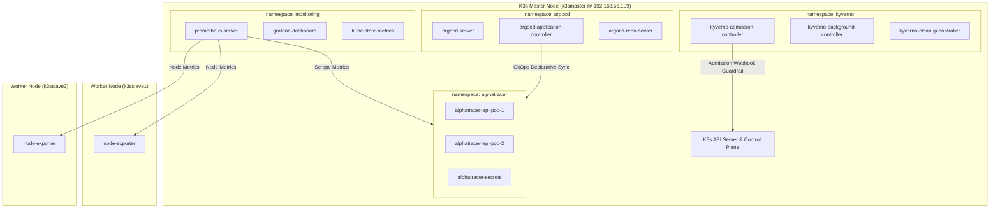
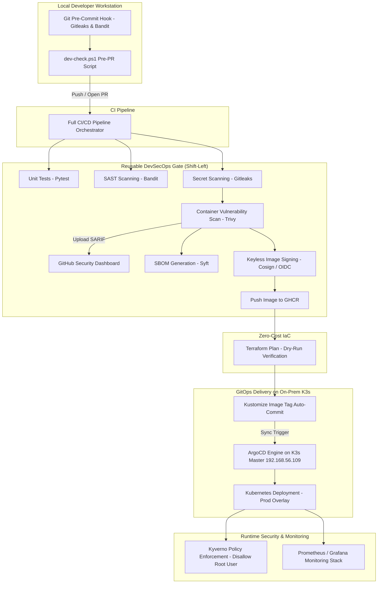
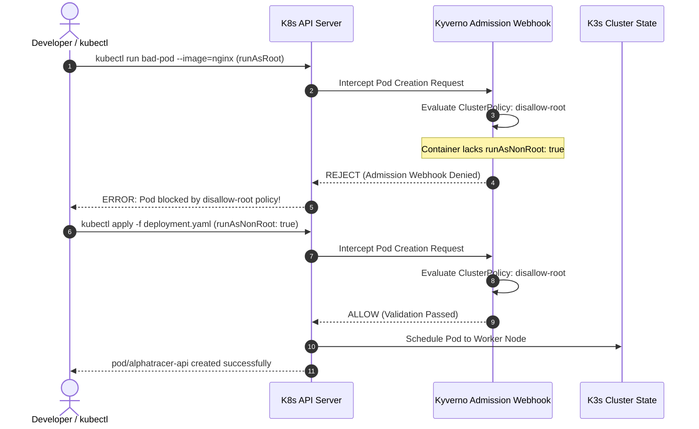

# 📈 AlphaTracer Financial API — Production-Grade DevSecOps & GitOps Platform

[](https://github.com/sebian-lab/alphatracer-financial-api/actions)
[](https://k3s.io/)
[](https://argoproj.github.io/argo-cd/)
[](https://kyverno.io/)
[](https://prometheus.io/)
[](https://www.terraform.io/)
[](#-developer-productivity--pre-pr-safeguards)
[](#-zero-cloud-cost--live-3-node-k3s-cluster-architecture)
[](#-market-alignment--target-roles-belgium--luxembourg)

> **Engineering Portfolio Project** demonstrating enterprise **DevSecOps**, **GitOps**, **Policy-as-Code**, and **Observability** running on a **100% Free / On-Premise 3-Node K3s Cluster** and **Free-Tier GitHub Actions**. Built specifically to target **DevOps / SecOps / DevSecOps Internship** positions across **Belgium** 🇧🇪 and **Luxembourg** 🇱🇺.

---

## 📖 Complete API Usage & Local Setup
For detailed endpoint usage, authentication flows, stock market data endpoints (Yahoo Finance), database configurations, and local execution steps, please refer to:
👉 **[View Detailed API Usage & Examples Guide](Usage&examples.md)** *(formerly main README)*.

---

## ⚡ Developer Productivity & Pre-PR Safeguards

To maintain zero security debt and prevent broken builds, the repository includes instant local developer tooling:

### 1. Git Pre-Commit Hooks (Instant 2-Second Scans)
Automatically scans staged files on every `git commit` to block secrets and high-severity code flaws before code leaves your workstation:

```bash
# Enable repository githooks (one-time setup)
git config core.hooksPath .githooks
```
- **Instant Secret Scan**: Runs `gitleaks protect --staged --verbose` to block secret leaks.
- **Fast SAST Scan**: Runs `bandit -r app/ -ll -ii` to detect high-severity Python flaws.

### 2. Single Dev Check Script (`dev-check.ps1`)
A 30-second automated pre-PR validation script run right before pushing branches or opening Pull Requests:

```powershell
# Run full pre-PR verification suite (~30s)
.\dev-check.ps1
```

```
🔍 Starting AlphaTracer DevSecOps Pre-PR Checks...

🧪 [1/6] Running Pytest Unit Tests... 19 passed in 0.94s ✅
🛡️ [2/6] Running Bandit SAST Code Analysis... ✅
🔒 [3/6] Running Gitleaks Secret Detection... no leaks found ✅
🏗️ [4/6] Validating Terraform Infrastructure Code... Success! ✅
📜 [5/6] Validating Kyverno Policy-as-Code Manifests... valid (dry run) ✅
📦 [6/6] Building Kustomize Kubernetes Production Overlay... ✅

🎉 ALL PRE-PR CHECKS PASSED SUCCESSFULLY! Ready to push & open PR. 🚀
```

---

## 🖥️ Zero Cloud Cost & Live 3-Node K3s Cluster Architecture

Unlike projects dependent on paid cloud resources (AWS/Azure/GCP), this environment demonstrates **practical, hands-on cluster administration**, bare-metal networking, and GitOps on a self-hosted **3-Node K3s Kubernetes Cluster** with **$0 cloud cost**.

### Live Cluster Topology (`kubectl get nodes -o wide`)

```
NAME        STATUS   ROLES           VERSION        INTERNAL-IP      OS-IMAGE           CONTAINER-RUNTIME
k3smaster   Ready    control-plane   v1.36.2+k3s1   192.168.56.109   Ubuntu 26.04 LTS   containerd://2.3.2-k3s2
k3sslave1   Ready    <none>          v1.36.2+k3s1   10.0.2.15        Ubuntu 26.04 LTS   containerd://2.3.2-k3s2
k3sslave2   Ready    <none>          v1.36.2+k3s1   10.0.2.15        Ubuntu 26.04 LTS   containerd://2.3.2-k3s2
```

### Live Cluster Namespaces & Component Architecture



---

## 🎯 Executive Summary & DevSecOps Flow

**AlphaTracer** is a high-performance Python FastAPI service providing real-time financial market data, technical indicators, and portfolio tracking backed by PostgreSQL.

The project demonstrates an end-to-end continuous delivery pipeline from git commit to cluster deployment:



---

## 🛡️ Policy-as-Code Enforcement (Kyverno)

Kyverno admission controller enforces zero-trust container security policies live on the K3s cluster:



---

## 🛠️ Complete DevSecOps Toolchain Summary

| Category | Tool | Purpose / Implementation | Verification |
| :--- | :--- | :--- | :--- |
| **API Application** | **FastAPI + PostgreSQL** | Financial market data & portfolio tracking backend | Tested via pytest & docker-compose |
| **Local Pre-Commit** | **Githooks + Gitleaks** | Instant 2s secret scan & lint check on `git commit` | `.githooks/pre-commit` |
| **Pre-PR Developer Check**| **dev-check.ps1** | 30s single script running Pytest, SAST, Gitleaks, Terraform & Kustomize | Verified clean execution |
| **CI/CD Orchestration** | **GitHub Actions** | Automated testing, security scanning, IaC plan, and GitOps image update | Free Public Tier Workflows |
| **Secret Scanning** | **Gitleaks** | Full git history scanning using custom `.gitleaks.toml` ruleset | Integrated in CI pipeline |
| **SAST** | **Bandit** | Static analysis of Python code for security flaws | Integrated in CI pipeline |
| **Container CVE Scan** | **Trivy** | Vulnerability scanning of built Docker images; outputs SARIF reports | Exported to GitHub Security tab |
| **Software Supply Chain**| **Syft (Anchore)** | Generates SPDX Software Bill of Materials (**SBOM**) | Saved as pipeline artifact |
| **Cryptographic Provenance**| **Cosign (Sigstore)**| Keyless image signing using GitHub OIDC tokens | Published to GHCR |
| **Infrastructure as Code**| **Terraform** | Modular AWS EKS & VPC IaC HCL definitions (`main.tf`, `variables.tf`) | Dry-run `terraform plan` in CI |
| **Manifest Management** | **Kustomize** | Declarative manifest management (`base` & `overlays/prod`) | Automated image tag updates |
| **GitOps Delivery Engine**| **ArgoCD** | Declarative continuous delivery and auto-sync on K3s cluster | Running in `argocd` namespace |
| **Policy Engine** | **Kyverno** | Admission control policy (`disallow-root.yaml`) blocking root pods | Live tested on K3s cluster |
| **Observability Stack** | **Prometheus + Grafana**| Metrics scraping (`/metrics`) and cluster node monitoring | Running in `monitoring` namespace |

---

## 🇧🇪🇱🇺 Market Alignment & Target Roles (Belgium & Luxembourg)

```
┌─────────────────────────────────────────────────────────────────────────┐
│                    BENELUX RECRUITER VALUE PROPOSITION                  │
├───────────────────────────────────────┬─────────────────────────────────┤
│ Luxembourg Fintech & Financial Sector  │ Belgium Enterprise & Consultancy│
├───────────────────────────────────────┼─────────────────────────────────┤
│ ✔ DORA & NIS2 Audit Readiness         │ ✔ Multi-Node K3s Cluster Admin  │
│ ✔ SARIF Dashboard Security Tracking   │ ✔ Declarative GitOps (ArgoCD)   │
│ ✔ Cryptographic Supply Chain (Cosign) │ ✔ Modular GitHub Actions & IaC  │
│ ✔ Policy-as-Code (Kyverno Enforcement)│ ✔ Pre-Commit & dev-check.ps1    │
└───────────────────────────────────────┴─────────────────────────────────┘
```

---

## 📝 Architecture Decision Records (ADRs)

### [ADR-001] Trivy Container Scanning over Grype
- **Decision**: Standardized on **Trivy** for single-pass OS and dependency scanning with native SARIF output for GitHub Security tab integration.

### [ADR-002] Security Gate Halts on HIGH & CRITICAL Findings Only
- **Decision**: Automated build breaks occur strictly on `HIGH` or `CRITICAL` severity CVEs to enforce DORA compliance while preserving developer velocity.

### [ADR-003] ArgoCD for Declarative GitOps
- **Decision**: Adopted **ArgoCD** for continuous deployment and visual sync status, matching the standard stack in Benelux financial institutions and consultancies.

### [ADR-004] Keyless Container Signing via Cosign & OIDC
- **Decision**: Implemented keyless signing leveraging GitHub short-lived OIDC identity tokens, reaching SLSA Level 3 supply chain security without managing static secret keys.

### [ADR-005] Self-Hosted 3-Node K3s Cluster over Paid Cloud EKS/AKS
- **Decision**: Built and deployed a **3-node K3s cluster** (`k3smaster` + 2 workers) on VirtualBox/local nodes (`192.168.56.109`), achieving full production Kubernetes parity, containerd runtime operations, and live ArgoCD/Kyverno/Prometheus execution with **$0 cloud cost**.

---

## 📂 Repository Structure

```
alphatracer-financial-api/
├── .githooks/
│   └── pre-commit                  # Instant 2s pre-commit hook (gitleaks & bandit)
├── .github/
│   └── workflows/
│       ├── main-ci.yml             # Orchestrator pipeline (Test, SAST, Security, IaC, GitOps)
│       └── reusable-security.yml   # Reusable SecOps pipeline (Gitleaks, Trivy, SBOM, Cosign)
├── app/                            # FastAPI application code & endpoints
├── infrastructure/
│   ├── terraform/                  # Terraform IaC (main.tf, variables.tf, backend.tf)
│   └── kubernetes/                 # Kubernetes Kustomize manifests & ArgoCD app
│       ├── base/                   # Base deployment & service definitions
│       └── overlays/prod/          # Production environment kustomization
├── policies/
│   └── kyverno/
│       └── disallow-root.yaml      # Kyverno policy enforcing non-root containers
├── tests/                          # Pytest test suite & endpoint integration scripts
├── .gitleaks.toml                  # Gitleaks secret scanning ruleset
├── dev-check.ps1                   # 30-second pre-PR developer validation script
├── Dockerfile                      # Multi-stage production container build
├── docker-compose.yml              # Production setup with PostgreSQL database
├── README.md                       # Main Recruiter & DevSecOps Architecture Overview
└── Usage&examples.md               # Detailed API Reference & Local Developer Guide
```

---

## ⚡ Quick Start & Verification Commands

From the repository root (`alphatracer-financial-api`):

```powershell
# 1. Enable Git Pre-Commit Hooks
git config core.hooksPath .githooks

# 2. Run Pre-PR Validation Script
.\dev-check.ps1

# 3. Create Secret in alphatracer namespace
kubectl -n alphatracer create secret generic alphatracer-secrets `
  --from-literal=database-url="postgresql://postgres:pass@db:5432/trading_db" `
  --from-literal=secret-key="your-very-secure-secret-key"

# 4. Apply Kyverno Policy (Policy-as-Code)
kubectl apply -f policies/kyverno/disallow-root.yaml

# 5. Deploy ArgoCD Application
kubectl apply -f infrastructure/kubernetes/argo-app.yaml
```

---

## 🔗 Related Documentation
- 📘 **[API Endpoints, Setup & Examples Guide](Usage&examples.md)**
- 🛠️ **[Deployment Troubleshooting Notes](DEPLOYMENT_ISSUES.md)**
- ⚙️ **[Local Environment Setup](README_SETUP.md)**

---

<p align="center">
  <i>Built with passion to demonstrate hands-on Kubernetes administration, shift-left security, and zero-cost DevOps excellence. Open for DevOps, SecOps, and DevSecOps internship opportunities in Belgium 🇧🇪 and Luxembourg 🇱🇺.</i>
</p>
# dummy


# 📈 AlphaTracer Financial API — Production-Grade DevSecOps & GitOps Platform

[](https://github.com/sebian-lab/alphatracer-financial-api/actions)
[](https://k3s.io/)
[](https://argoproj.github.io/argo-cd/)
[](https://kyverno.io/)
[](https://prometheus.io/)
[](https://www.terraform.io/)
[](#-developer-productivity--pre-pr-safeguards)
[](#-zero-cloud-cost--live-3-node-k3s-cluster-architecture)
[](#-market-alignment--target-roles-belgium--luxembourg)

> **Engineering Portfolio Project** demonstrating enterprise **DevSecOps**, **GitOps**, **Policy-as-Code**, and **Observability** running on a **100% Free / On-Premise 3-Node K3s Cluster** and **Free-Tier GitHub Actions**. Built specifically to target **DevOps / SecOps / DevSecOps Internship** positions across **Belgium** 🇧🇪 and **Luxembourg** 🇱🇺.

---

## 📖 Complete API Usage & Local Setup
For detailed endpoint usage, authentication flows, stock market data endpoints (Yahoo Finance), database configurations, and local execution steps, please refer to:
👉 **[View Detailed API Usage & Examples Guide](Usage&examples.md)** *(formerly main README)*.

---

## ⚡ Developer Productivity & Pre-PR Safeguards

To maintain zero security debt and prevent broken builds, the repository includes instant local developer tooling:

### 1. Git Pre-Commit Hooks (Instant 2-Second Scans)
Automatically scans staged files on every `git commit` to block secrets and high-severity code flaws before code leaves your workstation:

```bash
# Enable repository githooks (one-time setup)
git config core.hooksPath .githooks
```
- **Instant Secret Scan**: Runs `gitleaks protect --staged --verbose` to block secret leaks.
- **Fast SAST Scan**: Runs `bandit -r app/ -ll -ii` to detect high-severity Python flaws.

### 2. Single Dev Check Script (`dev-check.ps1`)
A 30-second automated pre-PR validation script run right before pushing branches or opening Pull Requests:

```powershell
# Run full pre-PR verification suite (~30s)
.\dev-check.ps1
```

```
🔍 Starting AlphaTracer DevSecOps Pre-PR Checks...

🧪 [1/6] Running Pytest Unit Tests... 19 passed in 0.94s ✅
🛡️ [2/6] Running Bandit SAST Code Analysis... ✅
🔒 [3/6] Running Gitleaks Secret Detection... no leaks found ✅
🏗️ [4/6] Validating Terraform Infrastructure Code... Success! ✅
📜 [5/6] Validating Kyverno Policy-as-Code Manifests... valid (dry run) ✅
📦 [6/6] Building Kustomize Kubernetes Production Overlay... ✅

🎉 ALL PRE-PR CHECKS PASSED SUCCESSFULLY! Ready to push & open PR. 🚀
```

---

## 🖥️ Zero Cloud Cost & Live 3-Node K3s Cluster Architecture

Unlike projects dependent on paid cloud resources (AWS/Azure/GCP), this environment demonstrates **practical, hands-on cluster administration**, bare-metal networking, and GitOps on a self-hosted **3-Node K3s Kubernetes Cluster** with **$0 cloud cost**.

### Live Cluster Topology (`kubectl get nodes -o wide`)

```
NAME        STATUS   ROLES           VERSION        INTERNAL-IP      OS-IMAGE           CONTAINER-RUNTIME
k3smaster   Ready    control-plane   v1.36.2+k3s1   192.168.56.109   Ubuntu 26.04 LTS   containerd://2.3.2-k3s2
k3sslave1   Ready    <none>          v1.36.2+k3s1   10.0.2.15        Ubuntu 26.04 LTS   containerd://2.3.2-k3s2
k3sslave2   Ready    <none>          v1.36.2+k3s1   10.0.2.15        Ubuntu 26.04 LTS   containerd://2.3.2-k3s2
```

### Live Cluster Namespaces & Component Architecture


---

## 🎯 Executive Summary & DevSecOps Flow

**AlphaTracer** is a high-performance Python FastAPI service providing real-time financial market data, technical indicators, and portfolio tracking backed by PostgreSQL.

The project demonstrates an end-to-end continuous delivery pipeline from git commit to cluster deployment:


---

## 🛡️ Policy-as-Code Enforcement (Kyverno)

Kyverno admission controller enforces zero-trust container security policies live on the K3s cluster:


---

## 🛠️ Complete DevSecOps Toolchain Summary

| Category | Tool | Purpose / Implementation | Verification |
| :--- | :--- | :--- | :--- |
| **API Application** | **FastAPI + PostgreSQL** | Financial market data & portfolio tracking backend | Tested via pytest & docker-compose |
| **Local Pre-Commit** | **Githooks + Gitleaks** | Instant 2s secret scan & lint check on `git commit` | `.githooks/pre-commit` |
| **Pre-PR Developer Check**| **dev-check.ps1** | 30s single script running Pytest, SAST, Gitleaks, Terraform & Kustomize | Verified clean execution |
| **CI/CD Orchestration** | **GitHub Actions** | Automated testing, security scanning, IaC plan, and GitOps image update | Free Public Tier Workflows |
| **Secret Scanning** | **Gitleaks** | Full git history scanning using custom `.gitleaks.toml` ruleset | Integrated in CI pipeline |
| **SAST** | **Bandit** | Static analysis of Python code for security flaws | Integrated in CI pipeline |
| **Container CVE Scan** | **Trivy** | Vulnerability scanning of built Docker images; outputs SARIF reports | Exported to GitHub Security tab |
| **Software Supply Chain**| **Syft (Anchore)** | Generates SPDX Software Bill of Materials (**SBOM**) | Saved as pipeline artifact |
| **Cryptographic Provenance**| **Cosign (Sigstore)**| Keyless image signing using GitHub OIDC tokens | Published to GHCR |
| **Infrastructure as Code**| **Terraform** | Modular AWS EKS & VPC IaC HCL definitions (`main.tf`, `variables.tf`) | Dry-run `terraform plan` in CI |
| **Manifest Management** | **Kustomize** | Declarative manifest management (`base` & `overlays/prod`) | Automated image tag updates |
| **GitOps Delivery Engine**| **ArgoCD** | Declarative continuous delivery and auto-sync on K3s cluster | Running in `argocd` namespace |
| **Policy Engine** | **Kyverno** | Admission control policy (`disallow-root.yaml`) blocking root pods | Live tested on K3s cluster |
| **Observability Stack** | **Prometheus + Grafana**| Metrics scraping (`/metrics`) and cluster node monitoring | Running in `monitoring` namespace |

---

## 🇧🇪🇱🇺 Market Alignment & Target Roles (Belgium & Luxembourg)

```
┌─────────────────────────────────────────────────────────────────────────┐
│                    BENELUX RECRUITER VALUE PROPOSITION                  │
├───────────────────────────────────────┬─────────────────────────────────┤
│ Luxembourg Fintech & Financial Sector  │ Belgium Enterprise & Consultancy│
├───────────────────────────────────────┼─────────────────────────────────┤
│ ✔ DORA & NIS2 Audit Readiness         │ ✔ Multi-Node K3s Cluster Admin  │
│ ✔ SARIF Dashboard Security Tracking   │ ✔ Declarative GitOps (ArgoCD)   │
│ ✔ Cryptographic Supply Chain (Cosign) │ ✔ Modular GitHub Actions & IaC  │
│ ✔ Policy-as-Code (Kyverno Enforcement)│ ✔ Pre-Commit & dev-check.ps1    │
└───────────────────────────────────────┴─────────────────────────────────┘
```

---

## 📝 Architecture Decision Records (ADRs)

### [ADR-001] Trivy Container Scanning over Grype
- **Decision**: Standardized on **Trivy** for single-pass OS and dependency scanning with native SARIF output for GitHub Security tab integration.

### [ADR-002] Security Gate Halts on HIGH & CRITICAL Findings Only
- **Decision**: Automated build breaks occur strictly on `HIGH` or `CRITICAL` severity CVEs to enforce DORA compliance while preserving developer velocity.

### [ADR-003] ArgoCD for Declarative GitOps
- **Decision**: Adopted **ArgoCD** for continuous deployment and visual sync status, matching the standard stack in Benelux financial institutions and consultancies.

### [ADR-004] Keyless Container Signing via Cosign & OIDC
- **Decision**: Implemented keyless signing leveraging GitHub short-lived OIDC identity tokens, reaching SLSA Level 3 supply chain security without managing static secret keys.

### [ADR-005] Self-Hosted 3-Node K3s Cluster over Paid Cloud EKS/AKS
- **Decision**: Built and deployed a **3-node K3s cluster** (`k3smaster` + 2 workers) on VirtualBox/local nodes (`192.168.56.109`), achieving full production Kubernetes parity, containerd runtime operations, and live ArgoCD/Kyverno/Prometheus execution with **$0 cloud cost**.

---

## 📂 Repository Structure

```
alphatracer-financial-api/
├── .githooks/
│   └── pre-commit                  # Instant 2s pre-commit hook (gitleaks & bandit)
├── .github/
│   └── workflows/
│       ├── main-ci.yml             # Orchestrator pipeline (Test, SAST, Security, IaC, GitOps)
│       └── reusable-security.yml   # Reusable SecOps pipeline (Gitleaks, Trivy, SBOM, Cosign)
├── app/                            # FastAPI application code & endpoints
├── infrastructure/
│   ├── terraform/                  # Terraform IaC (main.tf, variables.tf, backend.tf)
│   └── kubernetes/                 # Kubernetes Kustomize manifests & ArgoCD app
│       ├── base/                   # Base deployment & service definitions
│       └── overlays/prod/          # Production environment kustomization
├── policies/
│   └── kyverno/
│       └── disallow-root.yaml      # Kyverno policy enforcing non-root containers
├── tests/                          # Pytest test suite & endpoint integration scripts
├── .gitleaks.toml                  # Gitleaks secret scanning ruleset
├── dev-check.ps1                   # 30-second pre-PR developer validation script
├── Dockerfile                      # Multi-stage production container build
├── docker-compose.yml              # Production setup with PostgreSQL database
├── README.md                       # Main Recruiter & DevSecOps Architecture Overview
└── Usage&examples.md               # Detailed API Reference & Local Developer Guide
```

---

## ⚡ Quick Start & Verification Commands

From the repository root (`alphatracer-financial-api`):

```powershell
# 1. Enable Git Pre-Commit Hooks
git config core.hooksPath .githooks

# 2. Run Pre-PR Validation Script
.\dev-check.ps1

# 3. Create Secret in alphatracer namespace
kubectl -n alphatracer create secret generic alphatracer-secrets `
  --from-literal=database-url="postgresql://postgres:pass@db:5432/trading_db" `
  --from-literal=secret-key="your-very-secure-secret-key"

# 4. Apply Kyverno Policy (Policy-as-Code)
kubectl apply -f policies/kyverno/disallow-root.yaml

# 5. Deploy ArgoCD Application
kubectl apply -f infrastructure/kubernetes/argo-app.yaml
```

---

## 🔗 Related Documentation
- 📘 **[API Endpoints, Setup & Examples Guide](Usage&examples.md)**
- 🛠️ **[Deployment Troubleshooting Notes](DEPLOYMENT_ISSUES.md)**
- ⚙️ **[Local Environment Setup](README_SETUP.md)**

---

<p align="center">
  <i>Built with passion to demonstrate hands-on Kubernetes administration, shift-left security, and zero-cost DevOps excellence. Open for DevOps, SecOps, and DevSecOps internship opportunities in Belgium 🇧🇪 and Luxembourg 🇱🇺.</i>
</p>


