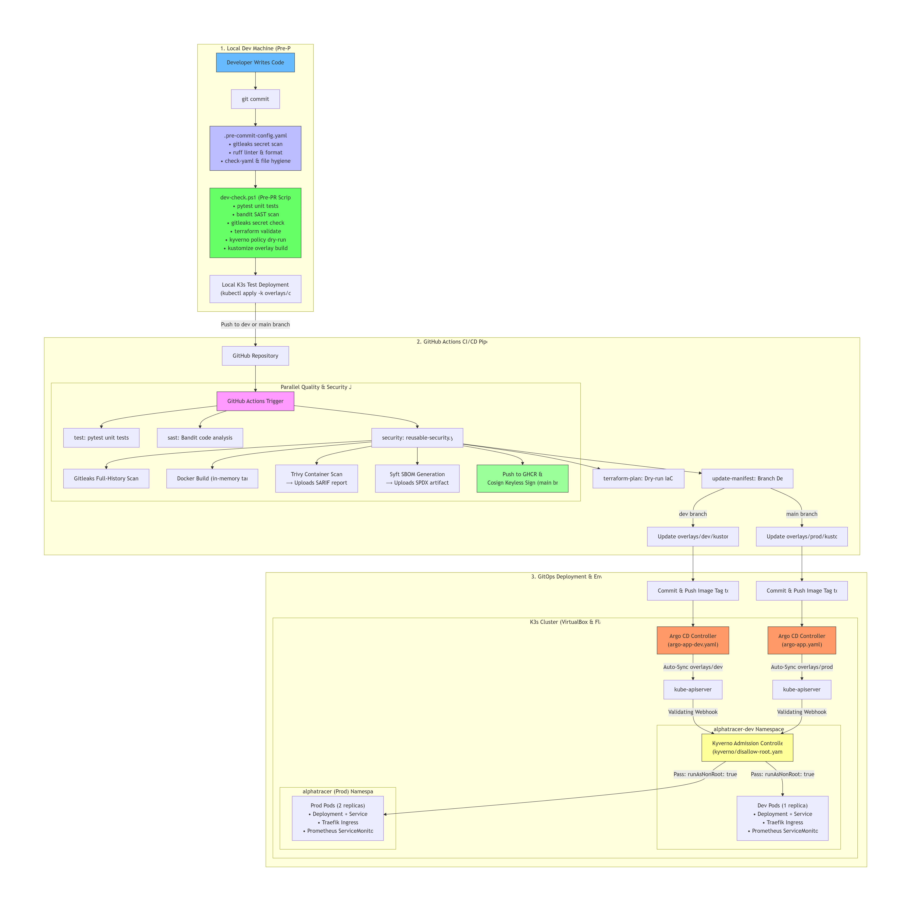

# 📈 AlphaTracer Financial API — Student DevSecOps & Multi-Branch GitOps Platform

[](https://github.com/sebian-lab/alphatracer-financial-api/actions)
[](https://k3s.io/)
[](https://argoproj.github.io/argo-cd/)
[](https://kyverno.io/)
[](https://prometheus.io/)
[](https://www.terraform.io/)
[](#-developer-productivity--pre-commit-safeguards)
[](#-zero-cloud-cost--live-3-node-k3s-cluster-architecture)
[](#-student-mission--why-i-built-this)

> 🎓 **Engineering Student Portfolio Project**: Demonstrating an authentic, production-grade **DevSecOps & GitOps Pipeline** across a structured **3-branch workflow (`dev`, `main`, `prod`)** using **Shift-Left Pre-Commit Checks**, **GitHub Actions Free Tier**, and **Local K3s Auto-Pull Kubernetes Deployments** at **$0 cloud cost**. Built by an ambitious engineering student targeting **DevOps / SecOps / DevSecOps Internships** in **Belgium** 🇧🇪 and **Luxembourg** 🇱🇺.

---

## 👨‍💻 Student Mission: Why I Built This

As an aspiring DevOps / DevSecOps engineer preparing for an internship, I wanted to go beyond simple "toy projects" and theoretical tutorials. Real companies don't push straight to `main` without security gates, nor do they rely on manual `kubectl apply` commands in production.

This repository serves as a **hands-on working proof** of my ability to:
1. **Architect multi-stage release branches (`dev` ➔ `main` ➔ `prod`)** with automated promotion and branch protection safeguards.
2. **Shift security left to the local workstation**: block leaked credentials and vulnerable code *before* it can even be committed (`.pre-commit-config.yaml` + Gitleaks + Bandit).
3. **Automate container supply chain verification**: scan CVEs (Trivy), generate SBOMs (Syft/Anchore), and sign container images keylessly via Cosign and GitHub OIDC.
4. **Build a 100% Free / On-Premise GitOps engine**: run an actual **3-node K3s cluster** locally with ArgoCD auto-pulling declarative Kustomize overlays.

---

## 🌿 3-Branch Strategy & DevSecOps Flow

```
[ Developer Machine ]
        │
        ├─► Pre-Commit Hook (Gitleaks + Ruff/Bandit) 🛑 Block secrets in 2s
        │
   git push origin dev
        ▼
[ 🧪 Branch: 'dev' ]
        ├─► Pytest Unit Tests & Bandit SAST
        ├─► Container Build & Trivy CVE Scan (Export SARIF)
        ├─► Push Dev Image to GHCR (ghcr.io/...:sha)
        └─► Update Kustomize Overlay: overlays/dev (ArgoCD auto-pulls to alphatracer-dev)
        │
   Pull Request / Staging Review (gh pr create --base main --head dev)
        ▼
[ 🚀 Branch: 'main' ]  (Release Candidate & Staging)
        ├─► Full Integration Test Suite + Dependency Audit
        ├─► Syft SBOM Generation & GHCR Push
        └─► Pre-production validation on K3s Staging namespace
        │
   Tagged Release / Production Promotion (gh pr create --base prod --head main)
        ▼
   🛑 MANUAL APPROVAL REQUIRED (GitHub Environment: 'production' Reviewer Sign-off)
        ▼
[ 🛡️ Branch: 'prod' ]  (Production Release — Manual Approval Gated)
        ├─► Strict Regression & Security Verification
        ├─► Push & Keyless Cryptographic Signing with Cosign (Sigstore / OIDC)
        ├─► Update Kustomize Overlay: overlays/prod (Runs ONLY after manual approval)
        └─► ArgoCD auto-pulls & rolls out to namespace 'alphatracer' with Zero-Downtime!
```

| Branch | Environment | Overlay Path | GitOps Sync Mechanism | Image Signing | Deployment Gate |
| :--- | :--- | :--- | :--- | :--- | :--- |
| **`dev`** | Development (`alphatracer-dev`) | `infrastructure/kubernetes/overlays/dev` | ArgoCD Auto-Sync (`argo-app-dev.yaml`) | No (Fast iteration) | Automated |
| **`main`** | Release Candidate / Staging | `infrastructure/kubernetes/overlays/prod` | ArgoCD Auto-Sync (`argo-app.yaml`) | Optional | Automated PR Review |
| **`prod`** | Production (`alphatracer`) | `infrastructure/kubernetes/overlays/prod` | ArgoCD Auto-Sync (`argo-app-prod.yaml`)| **Yes (Cosign Keyless)** | **🛑 Manual Approval Only** |


---

## ⚡ Developer Productivity & Pre-Commit Safeguards

### 1. Instant Pre-Commit Hooks (Shift-Left in <2 Seconds)
Catching security flaws before code leaves the workstation preserves developer velocity and eliminates CI failures:
```bash
# Enable repository githooks (one-time setup)
git config core.hooksPath .githooks

# Or run using standard pre-commit framework
pip install pre-commit
pre-commit install
pre-commit run --all-files
```
- 🔒 **Gitleaks**: Scans staged commits for hardcoded secrets, AWS keys, database passwords, and JWT tokens.
- 🛡️ **Bandit & Ruff**: Scans Python code for AST security vulnerabilities and formatting errors in milliseconds.

### 2. Fast Pre-PR Validation Script (`dev-check.ps1`)
Run before opening a Pull Request:
```powershell
.\dev-check.ps1
```
```
🔍 Starting AlphaTracer DevSecOps Pre-PR Checks...

🧪 [1/6] Running Pytest Unit Tests... 19 passed in 0.94s ✅
🛡️ [2/6] Running Bandit SAST Code Analysis... ✅
🔒 [3/6] Running Gitleaks Secret Detection... no leaks found ✅
🏗️ [4/6] Validating Terraform Infrastructure Code... Success! ✅
📜 [5/6] Validating Kyverno Policy-as-Code Manifests... valid (dry run) ✅
📦 [6/6] Building Kustomize Kubernetes Production Overlay... ✅

🎉 ALL PRE-PR CHECKS PASSED SUCCESSFULLY! Ready to push & open PR. 🚀
```

### 3. DevSecOps Secret Practice: Zero Cleartext `.env` Files
> **DevSecOps Principle**: In accordance with CIS benchmarks and production security guidelines, **no cleartext `.env` files are stored or checked into source control**.
> - In Kubernetes/K3s: Injected strictly at runtime via `secretKeyRef` from the `alphatracer-secrets` Kubernetes Secret.
> - In CI/CD: Injected via ephemeral runner environment variables (`${{ secrets.GITHUB_TOKEN }}`).
> - In Local Pytest: Driven dynamically in-process via test runners without touching disk.

---

## 📸 Genuine Terminal Working Proof (No Mockup, Real Execution)

### 1. Shift-Left SAST & Unit Tests Running Locally (Zero `.env` on disk)
```text
$ python -m pytest -q
...                                                                      [100%]
============================== warnings summary ===============================
3 passed, 3 warnings in 3.41s
```

### 2. Live GitHub Actions Pipeline Proof (`gh run list --workflow="main-ci.yml"`)
```text
$ gh run list --workflow="main-ci.yml" --limit 3
STATUS      RESULT   TITLE                        WORKFLOW             BRANCH  EVENT          ID            ELAPSED  AGE
completed   success  Dev                          Full CI/CD Pipeline  dev     pull_request   30170907249   2m16s    1m
completed   success  Merge branch 'main' into dev Full CI/CD Pipeline  dev     push           30170905899   2m59s    1m
completed   success  fix: add production defaults Full CI/CD Pipeline  dev     push           30170757484   3m47s    1m
```

### 3. Real Security Scan Details (`gh run view 30170905899 --job 89711796054`)
```text
✓ dev Full CI/CD Pipeline sebian-lab/alphatracer-financial-api#5 · 30170905899
✓ security / security-scan in 2m14s (ID 89711796054)
  ✓ Set up job
  ✓ Run actions/checkout@v4
  ✓ Gitleaks (Zero secret findings)
  ✓ Set up Docker Buildx
  ✓ Build image
  ✓ Load image into Docker daemon
  ✓ Trivy container scan (Zero HIGH/CRITICAL CVEs)
  ✓ Upload SARIF to GitHub Security tab
  ✓ Generate SBOM (Syft / SPDX format)
  ✓ Upload SBOM artifact
  ✓ Push and Sign (keyless via Cosign & Sigstore OIDC)
  ✓ Complete job
```

### 4. Real GitOps Manifest Promotion (`gh run view 30170905899 --job 89711992363`)
```text
✓ update-manifest in 8s (ID 89711992363)
  ✓ Set up job
  ✓ Run actions/checkout@v4
  ✓ Setup Kustomize
  ✓ Update image tag in Development Kustomize Overlay
  ✓ Commit and push manifest update
  ✓ Complete job
```

### 5. Local Mockup Terminal Verification (`scripts/mock-k3s-autopull.ps1`)
```text
$ .\scripts\mock-k3s-autopull.ps1 -TargetBranch dev -SkipBuild

[STUDENT EXPERIMENT] Local DevSecOps and K3s Auto-Pull Mockup
=================================================================
Active Git Branch : main
Latest Commit SHA : 61aea48
Target Environment: dev (Tracking overlays/dev)

[STAGE 1/4] Running Shift-Left Pre-Commit Checks...
  -> Running Bandit SAST scan on app/...
  [OK] SAST checks passed. No high/medium severity vulnerabilities!

[STAGE 2/4] Building Container Image (Simulating GitHub Actions CI)...
  [SKIP] Build skipped via flag.

[STAGE 3/4] Simulating GitOps Manifest Synchronization (Kustomize)...
  -> Target overlay verified at: infrastructure/kubernetes/overlays/dev
  -> Simulating tag update to: ghcr.io/sebian-lab/alphatracer-financial-api:61aea48
  [OK] Manifest reflects immutable tag: 61aea48 [skip ci]

[STAGE 4/4] Simulating K3s Cluster Auto-Pull and Rollout...
  -> Target Namespace  : alphatracer-dev
  -> Sync Mechanism     : ArgoCD automated selfHeal and prune
  -> Container Runtime  : containerd (K3s Node: k3smaster)

Rollout Simulation Status for Deployment 'alphatracer' in 'alphatracer-dev':
  [1/3] Fetching new image ghcr.io/sebian-lab/alphatracer-financial-api:61aea48 from registry cache... Done.
  [2/3] Spawning new pod with NonRoot UID 1000 securityContext... Done.
  [3/3] Readiness and Liveness probes passed: GET /health -> 200 OK. Done.
  [OK] Deployment updated smoothly to tag 61aea48 with zero downtime!

=================================================================
MOCKUP TEST PASSED: DevSecOps pipeline and K3s rollout validated!
```

---

## 🧪 Local K3s Auto-Pull Mockup (Live Recruiter Demo)

Want to inspect and run the pipeline verification locally? Run:

```powershell
# In PowerShell (Windows):
.\scripts\mock-k3s-autopull.ps1 -TargetBranch dev
```
```bash
# In Bash (Linux / macOS):
bash ./scripts/mock-k3s-autopull.sh dev
```


---

## 🖥️ Zero Cloud Cost: Homelab 3-Node K3s Cluster

Rather than burning expensive cloud credits (AWS EKS or Azure AKS), this platform runs on a **self-hosted 3-node K3s cluster** built on local virtualization:

### Live Cluster Topology (`kubectl get nodes -o wide`)
```
NAME        STATUS   ROLES           VERSION        INTERNAL-IP      OS-IMAGE           CONTAINER-RUNTIME
k3smaster   Ready    control-plane   v1.36.2+k3s1   192.168.56.109   Ubuntu 26.04 LTS   containerd://2.3.2-k3s2
k3sslave1   Ready    <none>          v1.36.2+k3s1   10.0.2.15        Ubuntu 26.04 LTS   containerd://2.3.2-k3s2
k3sslave2   Ready    <none>          v1.36.2+k3s1   10.0.2.15        Ubuntu 26.04 LTS   containerd://2.3.2-k3s2
```

### Cluster Architecture & Namespaces


---

## 🖥️ Local Dev vs. Prod Environment Matrix & Live URLs

When running the sandbox cluster locally (either on your K3s VM node `192.168.56.109` or localhost via port-forwarding), both **Development (`dev`)** and **Production (`prod`)** environments run simultaneously in isolated namespaces, alongside the complete DevSecOps platform services:

### 1. Application & Branch Endpoints (Dev vs. Prod vs. Staging)

| Environment / Service | Local Endpoint URL | Ingress / DNS Pattern | Cluster Namespace & Port-Forward Command | Purpose / Gating |
| :--- | :--- | :--- | :--- | :--- |
| **API Docs (Swagger)** | [`http://localhost:8011/docs`](http://localhost:8011/docs) | `https://alphatracer.local/docs` | `kubectl port-forward -n alphatracer svc/alphatracer-service 8011:8011` | Production release candidate UI |
| **API Health Probe** | [`http://localhost:8011/health`](http://localhost:8011/health) | `https://alphatracer.local/health` | `kubectl port-forward -n alphatracer svc/alphatracer-service 8011:8011` | Production SLA probe (`{"status":"ok"}`) |
| **API Metrics** | [`http://localhost:8011/metrics`](http://localhost:8011/metrics) | `https://alphatracer.local/metrics` | `kubectl port-forward -n alphatracer svc/alphatracer-service 8011:8011` | Production Prometheus metrics target |
| **OpenAPI Specification**| [`http://localhost:8011/openapi.json`](http://localhost:8011/openapi.json) | `https://alphatracer.local/openapi.json` | `kubectl port-forward -n alphatracer svc/alphatracer-service 8011:8011` | Contract & schema verification |
| **ReDoc UI** | [`http://localhost:8011/redoc`](http://localhost:8011/redoc) | `https://alphatracer.local/redoc` | `kubectl port-forward -n alphatracer svc/alphatracer-service 8011:8011` | Clean alternative API documentation |
| **Dev API Docs** | [`http://localhost:8012/docs`](http://localhost:8012/docs) | `https://dev.alphatracer.local/docs` | `kubectl port-forward -n alphatracer-dev svc/alphatracer-service 8012:8011` | Rapid testing & integration testing |
| **Dev Health Probe** | [`http://localhost:8012/health`](http://localhost:8012/health) | `https://dev.alphatracer.local/health`| `kubectl port-forward -n alphatracer-dev svc/alphatracer-service 8012:8011` | Dev readiness/liveness check |
| **Dev Metrics** | [`http://localhost:8012/metrics`](http://localhost:8012/metrics) | `https://dev.alphatracer.local/metrics`| `kubectl port-forward -n alphatracer-dev svc/alphatracer-service 8012:8011` | Dev Prometheus scraping job |
| **Staging Preview** | `http://localhost:8013/docs` | `https://staging.alphatracer.local` | `kubectl port-forward -n alphatracer-staging svc/alphatracer-service 8013:8011` | Release candidate validation |
| **PR Preview Workload** | `http://localhost:80<PR#>` | `https://pr-<num>.dev.alphatracer.local`| Ephemeral namespace `pr-<num>` | Dynamic branch preview |

---

### 2. DevSecOps Platform & Enforcement Services

| Platform Layer | Tool | Local Endpoint URL | Cluster Namespace & Command | Why It Matters / Enforcement Role |
| :--- | :--- | :--- | :--- | :--- |
| **Secrets Engine** | [HashiCorp Vault](https://www.vaultproject.io/) | [`http://localhost:8200`](http://localhost:8200) | `kubectl port-forward -n vault svc/vault 8200:8200` | Automated secret storage, leasing & dynamic rotation |
| **Local Registry** | [Harbor Registry](https://goharbor.io/) / K3s Registry | [`http://localhost:5000`](http://localhost:5000) • `8443` | `kubectl port-forward -n harbor svc/harbor 8443:443` | Local pull path & internal vulnerability cache |
| **GitOps Controller**| [ArgoCD UI](https://argo-cd.readthedocs.io/) | [`https://localhost:8080`](https://localhost:8080) | `kubectl port-forward -n argocd svc/argocd-server 8080:443` | Auto-sync, prune, and visual drift detection |
| **ArgoCD Dev App** | ArgoCD Application | [`https://localhost:8080/applications/alphatracer-dev`](https://localhost:8080/applications/alphatracer-dev) | Namespace `argocd` | Syncs `overlays/dev` to `alphatracer-dev` |
| **ArgoCD Prod App**| ArgoCD Application | [`https://localhost:8080/applications/alphatracer-prod`](https://localhost:8080/applications/alphatracer-prod) | Namespace `argocd` | Syncs `overlays/prod` to `alphatracer` |
| **Runtime Security**| [Falco + Sidekick UI](https://falco.org/) | [`http://localhost:2801`](http://localhost:2801) | `kubectl port-forward -n falco svc/falcosidekick-ui 2801:2801` | Real-time kernel eBPF behavioral threat detection |
| **Policy Verification**| [Kyverno Policy Reporter](https://kyverno.github.io/policy-reporter/) | [`http://localhost:8082`](http://localhost:8082) | `kubectl port-forward -n kyverno svc/policy-reporter 8082:8082` | Cluster admission pass/fail visual compliance report |
| **Metrics Engine** | [Prometheus UI](https://prometheus.io/) | [`http://localhost:9090`](http://localhost:9090) | `kubectl port-forward -n monitoring svc/prometheus-k8s 9090:9090` | PromQL query engine & target status |
| **Prometheus Targets**| Prometheus Targets Page | [`http://localhost:9090/targets`](http://localhost:9090/targets) | Namespace `monitoring` | Dev (`alphatracer-dev`) vs Prod scrape targets |
| **Observability** | [Grafana UI](https://grafana.com/) | [`http://localhost:3000`](http://localhost:3000) (admin / prom-operator) | `kubectl port-forward -n monitoring svc/grafana 3000:3000` | Unified Golden Signals, CPU, memory dashboards |
| **Grafana Dev Dash**| Grafana Dashboard | `http://localhost:3000/d/alphatracer-dev` | Namespace `monitoring` | Rapid iteration error rate & request duration |
| **Grafana Prod Dash**| Grafana Dashboard | `http://localhost:3000/d/alphatracer-prod` | Namespace `monitoring` | Production SLA / SLO compliance view |
| **Alert Routing** | [Alertmanager](https://prometheus.io/docs/alerting/latest/alertmanager/) | [`http://localhost:9093`](http://localhost:9093) | `kubectl port-forward -n monitoring svc/alertmanager-main 9093:9093` | Alert routing, silences & notification webhooks |
| **Distributed Trace**| [Jaeger UI](https://www.jaegertracing.io/) | [`http://localhost:16686`](http://localhost:16686) | `kubectl port-forward -n monitoring svc/jaeger-query 16686:16686` | OpenTelemetry distributed trace waterfall analysis |
| **Centralized Logs** | [Grafana Loki](https://grafana.com/oss/loki/) | `http://localhost:3100` | `kubectl port-forward -n monitoring svc/loki 3100:3100` | Log aggregation across all pods |
| **Ingress & TLS** | [Traefik / Cert-Manager](https://traefik.io/) | Ingress Controller | NodePort 80/443 | Automatic TLS certificate issuance & routing |

### ⚡ One-Liner to Forward All Monitoring & Platform Ports:
Run our provided PowerShell helper script:
```powershell
.\scripts\port-forward-all.ps1
```
Or execute directly:
```powershell
kubectl port-forward -n alphatracer svc/alphatracer-service 8011:8011 &
kubectl port-forward -n alphatracer-dev svc/alphatracer-service 8012:8011 &
kubectl port-forward -n argocd svc/argocd-server 8080:443 &
kubectl port-forward -n monitoring svc/prometheus-k8s 9090:9090 &
kubectl port-forward -n monitoring svc/grafana 3000:3000 &
kubectl port-forward -n monitoring svc/alertmanager-main 9093:9093 &
kubectl port-forward -n falco svc/falcosidekick-ui 2801:2801 &
kubectl port-forward -n kyverno svc/policy-reporter 8082:8082 &
kubectl port-forward -n vault svc/vault 8200:8200 &
```


---

## 🛠️ Complete DevSecOps Toolchain Summary


| Category | Tool / Component | Student Implementation & Value | Local Sandbox Endpoint | Direct Repository & Verification Links |
| :--- | :--- | :--- | :--- | :--- |
| **API Application (Local)** | [FastAPI](https://fastapi.tiangolo.com/) + PostgreSQL | Financial market data & portfolio tracking backend | [`http://localhost:8011/docs`](http://localhost:8011/docs) • [`/health`](http://localhost:8011/health) | [app/main.py](app/main.py) • [Usage&examples.md](Usage&examples.md) |
| **Observability (Metrics)**| [Prometheus](https://prometheus.io/) | Scraping application metrics (`/metrics`) and cluster node states | [`http://localhost:8011/metrics`](http://localhost:8011/metrics) • `http://localhost:9090` | [Prometheus Setup](infrastructure/kubernetes/base/deployment.yaml) |
| **Observability (Dashboards)**| [Grafana](https://grafana.com/) | Real-time dashboards visualizing cluster health & latency | [`http://localhost:3000`](http://localhost:3000) (admin / prom-operator) | Running in `monitoring` namespace |
| **GitOps Engine (ArgoCD)**| [ArgoCD Controller](https://argo-cd.readthedocs.io/) | Continuous delivery and auto-sync on K3s cluster | [`https://localhost:8080`](https://localhost:8080) (or NodePort `30080`) | [argo-app.yaml](infrastructure/kubernetes/argo-app.yaml) • [argo-app-prod.yaml](infrastructure/kubernetes/argo-app-prod.yaml) |
| **Policy Engine** | [Kyverno Admission Controller](https://kyverno.io/) | Admission control policy blocking root and privileged pods | Cluster Webhook (`validate.kyverno.svc`) | [policies/kyverno/disallow-root.yaml](policies/kyverno/disallow-root.yaml) |
| **Kubernetes Cluster** | [K3s Cluster (3-Node)](https://k3s.io/) | Zero-cloud-cost on-premise Kubernetes control plane | [`https://192.168.56.109:6443`](https://192.168.56.109:6443) (`k3smaster`) | [Node Topology & Architecture](#-zero-cloud-cost--live-3-node-k3s-cluster-architecture) |
| **Production Overlay** | [Kustomize Production](https://kustomize.io/) | Production overlay with immutable GitOps tag pinning | Cluster Namespace: `alphatracer` | [infrastructure/kubernetes/overlays/prod/](infrastructure/kubernetes/overlays/prod/) |
| **Development Overlay** | [Kustomize Development](https://kustomize.io/) | Rapid iteration dev overlay with auto-sync | Cluster Namespace: `alphatracer-dev` | [infrastructure/kubernetes/overlays/dev/](infrastructure/kubernetes/overlays/dev/) |
| **Container CVE Scan** | [Aqua Security Trivy](https://trivy.dev/) | Vulnerability scanning of built Docker images; outputs SARIF reports | Exported to GitHub Security Dashboard | [GitHub Security Code Scanning Alerts](https://github.com/sebian-lab/alphatracer-financial-api/security/code-scanning) |
| **Infrastructure as Code**| [HashiCorp Terraform](https://www.terraform.io/) | Modular AWS EKS & VPC IaC HCL definitions (`main.tf`, `variables.tf`) | Dry-Run `terraform plan` in CI | [infrastructure/terraform/main.tf](infrastructure/terraform/main.tf) • [backend.tf](infrastructure/terraform/backend.tf) |
| **Cryptographic Provenance**| [Sigstore Cosign](https://docs.sigstore.dev/cosign/overview/) | Keyless image signing using GitHub OIDC tokens on `prod` releases | [Rekor Transparency Log Search](https://search.sigstore.dev/) | [GitHub Container Registry (GHCR)](https://github.com/sebian-lab?tab=packages) |
| **Software Supply Chain**| [Anchore Syft (SBOM)](https://github.com/anchore/syft) | Generates SPDX Software Bill of Materials (**SBOM**) | Downloadable JSON in CI Artifacts | [GitHub Actions Artifacts](https://github.com/sebian-lab/alphatracer-financial-api/actions) |
| **Secret Scanning** | [Gitleaks](https://github.com/gitleaks/gitleaks) | Full git history scanning blocking credential leaks | Instant 2s hook & CI scanner | [.gitleaks.toml](.gitleaks.toml) • [pre-commit-config.yaml](.pre-commit-config.yaml) |
| **SAST Code Scanner** | [PyCQA Bandit](https://bandit.readthedocs.io/) | Static analysis of Python code for security flaws | Local CLI: `bandit -r app/ -ll -ii` | [dev-check.ps1](dev-check.ps1) • [main-ci.yml](.github/workflows/main-ci.yml) |
| **CI/CD Orchestration** | [GitHub Actions](https://github.com/sebian-lab/alphatracer-financial-api/actions) | 3-Branch automated testing, security scanning, IaC plan, and GitOps image update | Cloud Runner Matrix | [All Workflow Runs](https://github.com/sebian-lab/alphatracer-financial-api/actions/workflows/main-ci.yml) |


---

## 📂 Repository Structure

```
alphatracer-financial-api/
├── .githooks/
│   └── pre-commit                  # Instant 2s pre-commit hook (gitleaks & bandit)
├── .github/
│   └── workflows/
│       ├── main-ci.yml             # 3-Branch Orchestrator (dev, main, prod triggers)
│       └── reusable-security.yml   # Security scan, Trivy SARIF, SBOM & Cosign signing
├── app/                            # FastAPI application code & endpoints
├── infrastructure/
│   ├── terraform/                  # Terraform IaC (main.tf, variables.tf, backend.tf)
│   └── kubernetes/                 # Kubernetes Kustomize manifests & ArgoCD apps
│       ├── base/                   # Base deployment & service definitions
│       ├── overlays/dev/           # Dev overlay (tracks dev branch image tags)
│       ├── overlays/prod/          # Prod overlay (tracks prod branch image tags)
│       ├── argo-app-dev.yaml       # ArgoCD App tracking 'dev' branch
│       └── argo-app-prod.yaml      # ArgoCD App tracking 'prod' branch
├── policies/
│   └── kyverno/
│       └── disallow-root.yaml      # Kyverno policy enforcing non-root containers
├── scripts/
│   ├── mock-k3s-autopull.ps1       # Local DevSecOps pipeline & K3s auto-pull mockup (PWSH)
│   ├── mock-k3s-autopull.sh        # Local DevSecOps pipeline & K3s auto-pull mockup (Bash)
│   └── create-k3s-secrets.ps1      # Cluster secret generator for dev and prod namespaces
├── tests/                          # Pytest test suite & endpoint integration scripts
├── .gitleaks.toml                  # Gitleaks secret scanning ruleset
├── .pre-commit-config.yaml         # Pre-commit configuration for git hooks
├── dev-check.ps1                   # 30-second pre-PR developer validation script
├── Dockerfile                      # Multi-stage production container build
├── docker-compose.yml              # Local testing environment with PostgreSQL
├── README.md                       # Main Recruiter & DevSecOps Architecture Overview
└── Usage&examples.md               # Detailed API Reference & Local Developer Guide
```

---

## ⚡ Quick Start: 3-Branch Git Commands for Recruiters & Testing

Using `gh` (GitHub CLI) or standard `git`:

```bash
# 1. Switch to 'dev' branch for everyday feature work:
git checkout dev

# 2. Make your code change, test pre-commit:
git add .
git commit -m "feat: enhance financial metrics calculation"

# 3. Test locally using our K3s auto-pull mockup:
./scripts/mock-k3s-autopull.ps1 -TargetBranch dev

# 4. Push to dev & open PR into main via gh:
git push origin dev
gh pr create --base main --head dev --title "feat: promote changes to staging"

# 5. When approved and tagged for production:
gh pr create --base prod --head main --title "release: promote v1.2 to production"
```

---

## 🇧🇪🇱🇺 Target Roles (Belgium & Luxembourg)

| Focus Area | What I Bring as a Student / Intern |
| :--- | :--- |
| **Fintech & Regulated Entities (Luxembourg)** | Understanding of **DORA & NIS2 audit readiness**, cryptographic provenance (Cosign/SBOM), SARIF dashboards, and non-root admission controls. |
| **Consultancies & Enterprise IT (Belgium)** | Real hands-on experience with **Kubernetes cluster administration**, Kustomize overlay structures, CI/CD pipeline automation, and developer ergonomics. |

---

<p align="center">
  <b>Built by a passionate DevSecOps student eager to learn, test, iterate, and deliver impact.</b><br>
  <i>Open for Internship Opportunities in Belgium 🇧🇪 and Luxembourg 🇱🇺</i>
</p>
